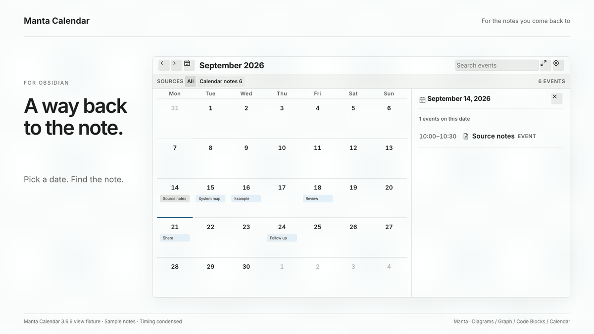

# Manta Calendar

Find dated notes in a calendar and open them with one click.

**[Install in Obsidian](https://community.obsidian.md/plugins/link-calendar) · [Try the demo Vault](https://github.com/woonyong-choi/obsidian-navigator-demo-vault/releases/latest) · [User guide](docs/user-guide.md)**

Version: **4.0.0** · Obsidian **1.13.0+** · **macOS and Windows**. See [release notes](CHANGELOG.md) for changes and the [roadmap](ROADMAP.md) for work in progress and plans.

<picture>
  <source media="(prefers-color-scheme: dark)" srcset="docs/assets/manta-calendar-intro-dark.gif">
  
</picture>

A six-second loop of the current view using sample notes. Timing is condensed. This is a view fixture; the original Obsidian capture is below.

## Install and try

1. Open the [existing Community entry](https://community.obsidian.md/plugins/link-calendar) in Obsidian, then install and enable it.
2. Add `- 2026-09-10 scheduled · Project check-in` to a normal note, outside a code block.
3. Run **Open Manta Calendar**, navigate to September 2026, and select September 10. Select the event to open its note.

The local calendar needs no account. Optional Google sync connects selected note folders to a dedicated **Manta Calendar**; manual two-way sync is opt-in. Sign in with your own Google account in your default browser. Authorization and calendar requests go directly between your computer and Google, with no Manta server or personal domain in between. [Setup and limitations](docs/google-calendar.md).

Upgrading from 3.x requires one new Google sign-in on each computer. Existing calendars, source selections, and event mappings are preserved. If the old calendar is unavailable through the new connection, select **Create calendar if unavailable** to prepare an empty Manta Calendar. Old events remain in their original calendar; synchronization is a separate action. Version 4 supports desktop Obsidian on macOS and Windows; it does not run on iOS or Android.

Manual installation: download the three plugin files from [Releases](https://github.com/woonyong-choi/manta-calendar/releases/latest) into `.obsidian/plugins/link-calendar/`, then reload Obsidian.

Original runtime capture and recorded version

Obsidian desktop capture, September 8, 2026 (3.6.0); the illustrated calendar view is unchanged in 4.0.0. Google authentication is not shown.

## Part of the Manta family

Return to a dated experiment, then follow its supporting notes, diagram and runnable example. [Manta Diagrams](https://github.com/woonyong-choi/manta-diagrams), [Manta Graph](https://github.com/woonyong-choi/manta-graph), [Manta Code Blocks](https://github.com/woonyong-choi/manta-code-blocks) each work on their own. Ordinary notes and links connect the work today; automatic handoffs are planned.

**Manta itself is in development and has not been released.** I’m building it to turn source material into a personal wiki you can keep adding to. Shared AI tools and the full wiki workflow are still in development.

## Help and development

[User guide](docs/user-guide.md) · [Report a problem](https://github.com/woonyong-choi/manta-calendar/issues) · [Community page](https://community.obsidian.md/plugins/link-calendar) · [Contributing](CONTRIBUTING.md)

Read the Google data [privacy policy](PRIVACY.md) before connecting your account.

[MIT](LICENSE)
