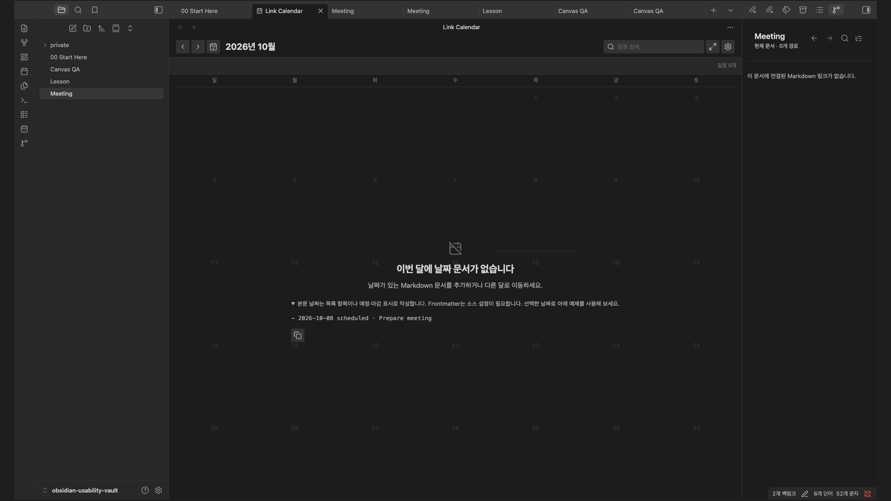

# Manta Calendar

Find dated notes in a calendar and open them with one click.

**[Install in Obsidian](https://community.obsidian.md/plugins/link-calendar) · [Try the demo Vault](https://github.com/woonyong-choi/obsidian-navigator-demo-vault/releases/latest) · [User guide](docs/user-guide.md)**

Version: **3.6.6** · Obsidian **1.13.0+** · Desktop and mobile. See [release notes](CHANGELOG.md) for changes and the [roadmap](ROADMAP.md) for work in progress and plans.

## Install and try

1. Open the [existing Community entry](https://community.obsidian.md/plugins/link-calendar) in Obsidian, then install and enable it. The entry may still show its previous name while the directory updates.
2. Add `- 2026-09-10 scheduled · Project check-in` to a normal note, outside a code block.
3. Run **Open Manta Calendar**, navigate to September 2026, and select September 10. Select the event to open its note.

The local calendar needs no account. Optional Google sync connects selected note folders to a dedicated **Link Calendar**; manual two-way sync is opt-in. [Setup and limitations](docs/google-calendar.md).

Manual installation: download the three plugin files from [Releases](https://github.com/woonyong-choi/manta-calendar/releases/latest) into `.obsidian/plugins/link-calendar/`, then reload Obsidian.

Obsidian desktop capture, September 8, 2026 (3.6.0); the illustrated calendar view is unchanged in 3.6.5. Google authentication is not shown.

## Help and development

[User guide](docs/user-guide.md) · [Report a problem](https://github.com/woonyong-choi/manta-calendar/issues) · [Community page](https://community.obsidian.md/plugins/link-calendar) · [Contributing](CONTRIBUTING.md)

Read the Google data [privacy policy](PRIVACY.md) before connecting your account.

[MIT](LICENSE)
