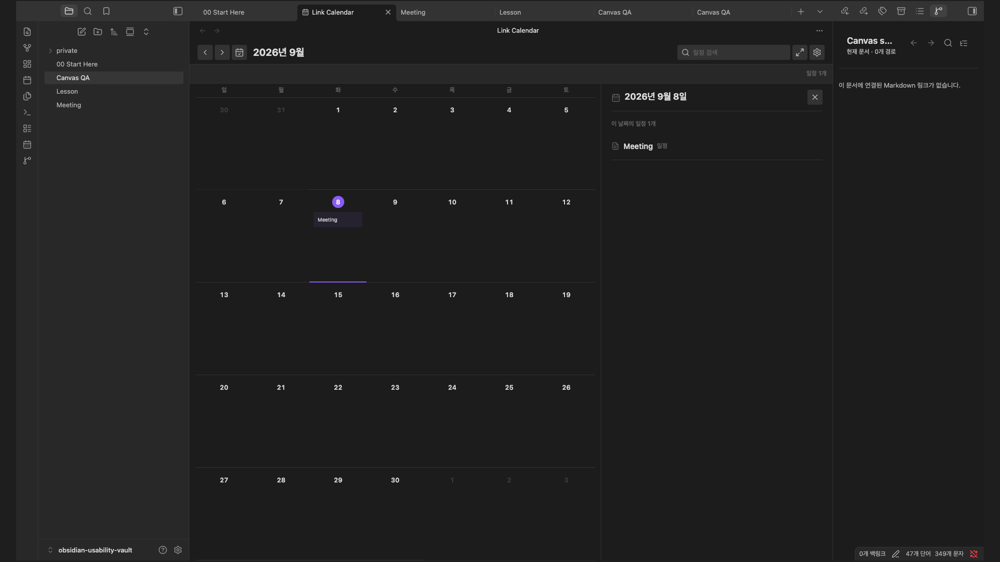

# Manta Calendar user guide

[Back to the overview](../README.md)

## First timeline: one note, one date

1. Open **Settings → Community plugins → Browse**, search for **Manta Calendar**, then **Install** and **Enable**.
2. Create a normal note named `Project check-in`. Paste this line into the note body, outside a code block:

```markdown
- 2026-09-10 scheduled · Project check-in
```

3. Open the command palette and run **Open Manta Calendar**, or select its calendar ribbon icon.
4. Navigate to **September 2026** and select **September 10**. You should see **Project check-in** in the month and selected-day agenda.
5. Select the event title to return to `Project check-in.md`.

No account, folder configuration, or date property is needed for this example. You can replace the date with today's `YYYY-MM-DD` date and use **Today** instead. The automatic calendar reads the note; it does not rewrite it.

**Useful next steps:** collect meeting dates across notes, follow a multi-day project period, or find every note mentioning the same milestone. For an empty month, the built-in example help explains the accepted date forms.

## What you can do

- **Zero-setup timeline:** explicit timeline entries in active Markdown bodies are indexed automatically.
- **Your notes remain the source:** the index is derived in memory; notes are never copied into a plugin database.
- **One item, all sources:** repeated mentions collapse into one timeline item with source-note and mentioning-note links.
- **Low-noise by default:** file timestamps, maintenance properties, and arbitrary prose dates never become events.
- **Read-only automation:** automatic results cannot rewrite source notes.
- **Optional controlled writing:** folder profiles can explicitly allow note creation and conflict-checked date moves.
- **Local by default:** no account or network request is used until Google Calendar is explicitly enabled and connected.

## Optional Google Calendar sync

The local calendar works offline. Google is optional and off by default. Connecting creates a separate calendar named **Link Calendar** in your Google account; you do not need to create a Google developer project.

| What you want | What to choose |
| --- | --- |
| Only find dates already in your notes | Leave Google disabled; use the first example above. |
| Send calendar notes to Google for its reminders | Select the note-folder sources to send, connect Google, then select **Sync now**. |
| Create or edit events in either app | Also choose a writable folder source under **Two-way sync destination**, then select **Sync now**. |

A **source** means a folder of Obsidian notes with mapped date properties. It is not your Google account or primary calendar. Automatic dates found in note bodies are not sent to Google by selecting two-way sync.

### First two-way sync

1. In **Calendar settings**, use **Add source** for the note folder that will hold your calendar notes. Enable **Writable** and configure distinct title, start/end date, time, and all-day properties. The source preview shows what matches before you use it.
2. Enable **Google Calendar**, select **Connect Google Calendar**, and authorize your account in the browser. Return to the same Obsidian Vault.
3. Select that folder source for Google sync and choose it as **Two-way sync destination**.
4. In Google Calendar, create a simple, non-recurring event in **Link Calendar**. In Obsidian, select **Sync now**. A new note should appear in the chosen folder.
5. Change a mapped title or date in that note and select **Sync now** again. The corresponding event in **Link Calendar** should update.

Sync is manual and Obsidian must be open. If both sides changed, sync asks you to review the conflict instead of overwriting either one. Deleting on one side does not delete the other. Recurring events are not imported. Primary and unrelated Google calendars stay outside this integration.

See the [complete Google setup, supported fields, and recovery guide](google-calendar.md).

<details>
<summary>Sync boundaries, permissions, and less common cases</summary>

Google Calendar integration is off by default. When you enable it, one **Connect Google Calendar** action creates a dedicated **Link Calendar** in your account. You do not create an OAuth client or paste credentials.

1. Add or choose the folder sources whose mapped events may leave Obsidian.
2. Enable **Google Calendar** and connect your account in the browser.
3. Turn on only the source mappings you want, then select **Sync now**.

The default is **configured Markdown source → dedicated Google calendar**. To enable both directions, choose a writable source in **Two-way sync destination**, then run **Sync now**. New non-recurring Google events in the dedicated calendar become notes in that folder; Google title/date/time edits update mapped writable notes. Notes retain their bodies and unrelated properties. If both sides changed, neither overwrites the other. Remote descriptions, reminders, guests, primary and unrelated calendars remain outside the write boundary.

Deletion is not propagated: a missing or cancelled mapped event is reported and the surviving note or Google event is preserved. Recurring and special Google event types are reported as unsupported instead of being flattened or altered. Imports require distinct title/date/end/time/all-day property mappings. Event times are converted into the dedicated calendar's time zone at minute precision; sub-minute times are rejected. Listing is bounded to 10,000 events per manual sync.

Source selection explicitly permits sending events, independently of whether the source is editable. Only an explicit `external_sync: deny` prevents sending a selected note; read-only editing and `access: local-only` do not. Denied notes are counted in the sync summary. Excluding a note preserves its existing mapping and does not delete an earlier Google event.

The dedicated calendar appears in Google Calendar on desktop and mobile, so its normal notifications remain available even when Obsidian is closed. Obsidian must be open when you run a sync; synchronization does not run in the background.

Only the narrow `calendar.app.created` permission is requested. Refresh tokens stay in Obsidian `SecretStorage`. Authorization, token refresh, and event requests go directly from your computer to Google; no Manta domain or server receives them. See [Google Calendar privacy and security](google-calendar.md) and the [privacy policy](../PRIVACY.md).

</details>

## Two inputs, one timeline

The calendar accepts only two inputs: explicit timeline entries in Markdown bodies, and date properties from folders you deliberately configure as calendar sources. It never promotes file creation or modification timestamps.

### Markdown body

```markdown
- 2026-08-04 → 2026-08-17 · [[Workshop preparation]]
- 2026-08-24 → ongoing · [[Research project]]
- 2026-09-02 scheduled · [[Team review]]
- 2026-09-03 14:00–15:30 scheduled · [[Design review]]
- 2026-09-10 deadline · [[Draft submission]]
- 2026-08-25 · Result confirmed
```

Korean equivalents `진행 중`, `예정`, and `마감` work too. Explicit body entries accept 24-hour wall-clock values such as `14:00` and `14:00–15:30`; the agenda can display them in either 12-hour or 24-hour format. A single-date history entry must be a Markdown list item. Dates in arbitrary prose, YAML frontmatter, fenced or inline code, blockquotes, URLs, and HTML comments are not reinterpreted by the automatic index.

### Configured calendar sources

When a folder already uses date properties, add it once in plugin settings and map its start, end, title, time, and category fields. Only that configured source reads frontmatter; automatic Vault-wide indexing does not guess property names.

ISO dates such as `2026-09-02` and ISO date-times are supported. Invalid or reversed ranges are ignored rather than rewritten.

Time values are treated as wall-clock values: `2026-09-02T14:00:00+09:00` remains `14:00` when displayed in 24-hour mode. Link Calendar does not silently shift an authored time to the operating-system timezone. Choose **12-hour** or **24-hour** under **Calendar settings → Time format**; this changes presentation only.

## Deduplication and provenance

The same period can be repeated across a project plan, meeting note, and progress log:

```markdown
[[Community workshop]] · 2026-08-02 → 2026-08-27
```

Manta Calendar uses one stable identity:

```text
canonical target + start date + end date + temporal kind
```

Matching entries become one calendar item. The selected-day panel puts a document icon and the event kind beside the title. It omits an identical source-note label and lists other notes that mention the item:

```text
Community workshop
2026-08-02 → 2026-08-27

Mentioned in 4 notes
```

Aliases and relative wikilinks resolve through Obsidian's metadata cache. Hidden folders and archival/reference folders such as `_sources`, `archive`, `backups`, and `retired` are excluded from automatic indexing and cannot become canonical targets, so old copies cannot inflate provenance or replace an active note.

## Month and agenda workflow

1. **Scan a month.** Compact one-line titles identify events, periods, history, and deadlines.
2. **Choose a day.** The agenda lists every item overlapping that date.
3. **Open the evidence.** Select the title for the source note, or a provenance link for a mentioning note.



Month navigation keeps the selected day and agenda synchronized. Multi-day periods remain visible on every overlapping day, while each cell stays bounded to three one-line titles plus a readable overflow row. Long titles end with an ellipsis; the full title remains available to assistive technology and as a tooltip.

## Navigation and accessibility

- Select a day or event title to open the agenda.
- Select the title beside the document icon to open the source note.
- Press `Cmd/Ctrl + Enter` on a focused event title to open its note directly.
- Use arrow keys to move the selected day; `Enter` or `Space` opens its agenda.
- Press `Escape` to close the agenda and restore focus.
- Run **Reveal active note in calendar** to locate the current dated note.
- Select **Today** or run **Show today in Manta Calendar** to return to the current date.
- Use search, source filters, and focus mode without changing Markdown.

The UI uses Obsidian semantic theme variables, supports narrow desktop side panes, and respects reduced motion and forced colors.

## Optional source profiles

Automatic indexing is read-only. Add a source profile only when you need different property names, folder/tag scoping, or controlled writes.

The guided source preview reports the exact folder, Markdown count, detected date properties, and matched-note count before setup. New profiles remain read-only until you explicitly enable **Writable**.

For an enabled writable profile, the plugin can:

- create a Markdown event note through Obsidian's public `Vault` API;
- move only the mapped start and end properties;
- offer one conflict-checked Undo after a successful move.

Before every move, it confirms that the file still belongs to the same writable profile and that the indexed dates still match. Concurrent changes stop the move instead of being overwritten. Automatic timeline items are never draggable.

## Embedded agenda

Embed a compact, read-only upcoming list with a `link-calendar` code block:

~~~markdown
```link-calendar
source: Learning
title: Learning calendar
```
~~~

`source` is an optional Vault folder prefix and `title` is optional display text.

## Privacy, performance, and limits

- All extraction and deduplication run locally inside Obsidian.
- The index stores derived event metadata only in memory and rebuilds from Markdown.
- The local calendar index has no persistent event database; optional Google sync stores only mapping IDs, ETags, and fingerprints needed for safe retries.
- With Google Calendar disabled, no note body, title, date, or path leaves the app.
- With Google Calendar enabled, only mapped event titles and start/end values are sent directly to Google Calendar during an explicit sync.
- Login uses your default browser and a temporary callback on your own computer. Google tokens are exchanged and refreshed directly with Google; there is no authentication relay or analytics.
- Automatic body reads are batched so Obsidian can render between batches.
- The test suite includes a 5,000-note automatic-index fixture.
- Explicit writable-profile ranges longer than 370 days are rejected as diagnostics.

Removing the plugin leaves every Markdown note and property intact.

## Troubleshooting

Version 3.6.3 discards late Google token responses after disconnecting and late date reads after rebuilding the index. Disconnecting stays disconnected; disabled or removed date sources do not reappear from an earlier read.

- **A date is missing:** use one of the explicit Markdown forms above or map the note folder as a calendar source. Dates in prose, code, quotes, URLs, comments, hidden paths, and archive/reference folders are intentionally ignored.
- **A maintenance date is missing:** this is intentional. `created`, `updated`, filesystem timestamps, and similar bookkeeping fields are not automatic events.
- **Repeated entries:** make each mention link to the same source note and use the same start, end, and temporal kind.
- **Create or drag is unavailable:** automatic items are read-only; enable a valid writable folder profile for mutations.
- **A move was rejected:** the Markdown changed after indexing or no longer matches the configured source.
- **Search shows no results:** clear the query and source filters to restore the month.
- **Google Calendar is unavailable:** use the official desktop release. Development builds need the maintainer's Desktop app registration values. End users do not enter developer credentials.
- **Google connection stays waiting:** keep Obsidian open on the computer where you started. Complete Google approval in that computer's default browser; return to Obsidian to check the result. Cancel and reconnect if ten minutes pass or the callback is blocked. Check whether a firewall prevents Obsidian from receiving loopback connections; do not disable your firewall globally.
- **Upgrading from 3.x:** connect Google once again on each computer. Existing calendars, source selections, and mappings are preserved. Old authorization links and relay tokens are no longer used.
- **A Google event was not overwritten:** check the sync summary. A remote ETag change is reported as a conflict instead of being replaced.
- **A deleted note remains in Google:** this is intentional. Remote deletion is never inferred from a missing local file.
- **The dedicated Google calendar is unavailable:** use **Create calendar if unavailable** to check access and explicitly create an empty replacement after a 404. This preserves previous mappings and does not sync events automatically.

## Installation and compatibility

Version **4.0.0** requires Obsidian **1.13.0+** on **macOS or Windows**. Obsidian mobile on iOS and Android is not supported.

| Feature | macOS | Windows | Network |
| --- | --- | --- | --- |
| Local month, agenda, and note navigation | Supported | Supported | None |
| Google sync | Supported | Supported | Needed when connecting or selecting Sync now |
| Google reminders after a sync | Managed by Google Calendar | Managed by Google Calendar | Obsidian can be closed |

Recent captures use desktop Obsidian 1.13.7 and show the calendar view. Google Calendar's own mobile app can still show events that were synced from a PC; the Obsidian plugin itself runs only on desktop.

For a manual release install, download `main.js`, `manifest.json`, and `styles.css` from the [latest release](https://github.com/woonyong-choi/manta-calendar/releases/latest) into `.obsidian/plugins/link-calendar/`, then reload Obsidian.
